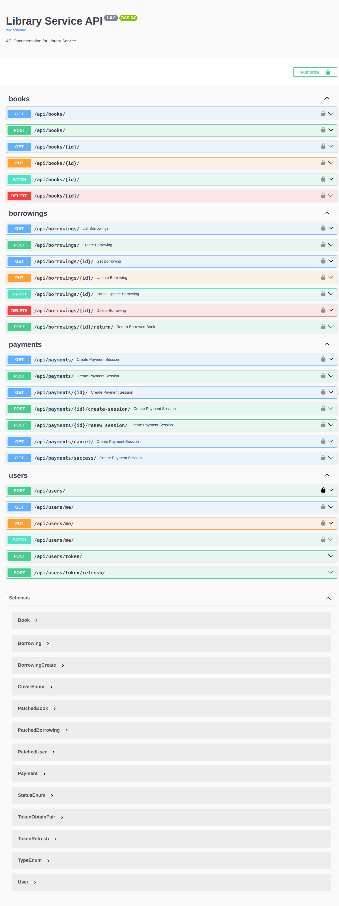

# Library Management System

This is a comprehensive Library Management System that allows users to borrow books, make payments for overdue books, and manage their account. It integrates various services including user management, book management, borrowing tracking, and payment processing via Stripe.

## Features

- **User Authentication**: Users can register, log in, and manage their profiles.
- **Book Management**: Admins can add, update, or delete books. Books have details like title, author, cover type, inventory count, and daily fee.
- **Borrowing System**: Users can borrow books, and track their borrowings. The system supports overdue fines.
- **Payment Integration**: Payments are handled via Stripe, allowing users to pay fines or fees for borrowed books.
- **Admin Interface**: Admin users can view all borrowings and payments, while regular users can only see their own.

## Tech Stack

- **Django 5.1.4**: The web framework used to build the backend.
- **Django Rest Framework**: For building APIs.
- **PostgreSQL**: Database for storing user, book, borrowing, and payment data.
- **Stripe**: Payment gateway for handling payments and fines.
- **Celery**: For background tasks, such as checking expired payment sessions.
- **Redis**: For caching and Celery task queue.
- **Docker**: For containerization of the entire application.

## Setup and Installation

### Prerequisites

- Docker
- Docker Compose
- Python 3.10+
- Poetry (for dependency management)

### Steps to Run the Project

#### Running Locally

1. Clone the repository:
   ```bash
   git clone <repository-url>
   cd <project-directory>
   ```
2. Create and activate a virtual environment:
   ```bash
   python -m venv venv
   source venv/bin/activate  # On Windows: venv\Scripts\activate
   ```

3. Install dependencies using Poetry:
   ```bash
   poetry install
   ```

4. Apply database migrations:
   ```bash
   python manage.py migrate
   ```

5. Start Redis in a Docker container:
   ```bash
   docker run -d -p 6379:6379 redis
   ```

6. Run the Celery worker:
   #### Linux/MacOS:
   ```bash
   celery -A core worker --loglevel=info
   ```
   #### Windows:
   ```bash
   celery -A core worker --app=app.app --pool=solo
   ```

7. Start the development server:
   ```bash
   python manage.py runserver

#### Running with docker

1. Clone the repository:
   ```bash
   git clone <repository-url>
   cd <project-directory>
   ```

2. Build the Docker containers:
   ```bash
   docker-compose build
   ```

3. Start the containers:
   ```bash
   docker-compose up
   ```

   This will start the Django application, the PostgreSQL database, Redis for caching and Celery.

4. After the containers are up, you can access the API at `http://localhost:8000/`.

### Creating a Superuser

To create an admin user, run the following command:

```bash
docker-compose exec web python manage.py createsuperuser
```

Follow the prompts to create the superuser.

### Accessing the API Documentation

Once the server is running, you can access the API documentation using Swagger or ReDoc:

- Swagger: `http://localhost:8000/api/schema/swagger/`
- ReDoc: `http://localhost:8000/api/schema/redoc/`

## Endpoints

- **POST** `/api/users/` - Create a new user.
- **POST** `/api/token/` - Obtain JWT token for authentication.
- **GET** `/api/me/` - View and update the logged-in user's profile.
- **GET** `/api/books/` - List all books.
- **POST** `/api/books/` - Add a new book (admin only).
- **GET** `/api/borrowings/` - List all borrowings of the logged-in user.
- **POST** `/api/borrowings/` - Create a new borrowing.
- **POST** `/api/payments/create-session/` - Create a Stripe payment session for a borrowing.

